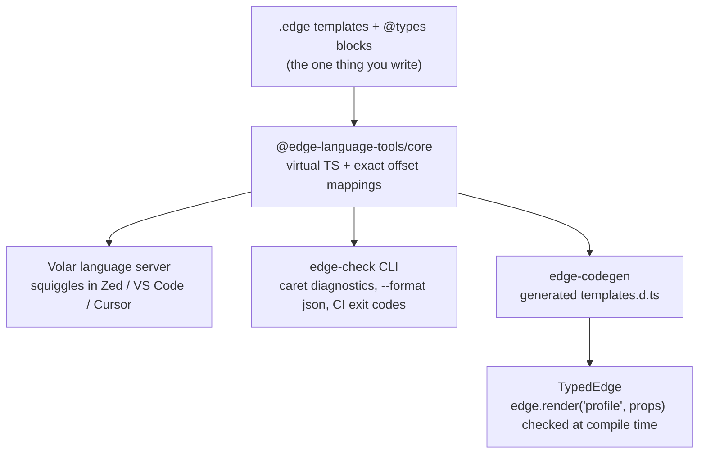
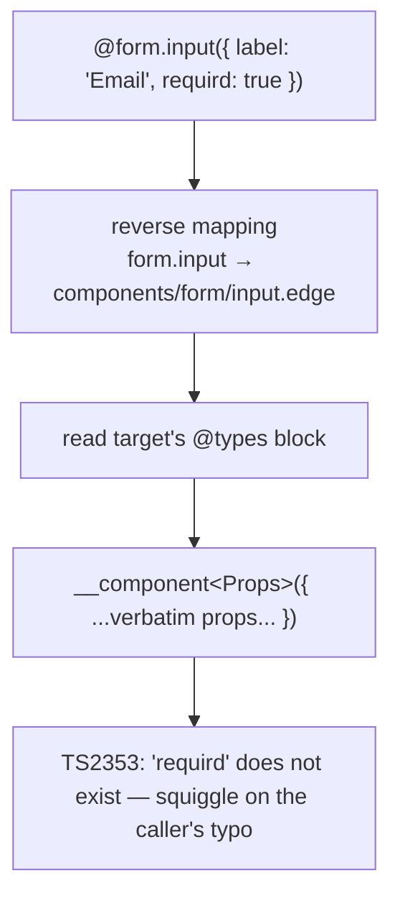

# Teaching an old template dog new type tricks

## How EdgeJS got red squiggles, typed render calls, and a language server in one very long day

I love EdgeJS. Coming from years of Twig and Blade, it is the template language that feels most like home in JavaScript land: the same comfortable `@if`/`@each`/`@include` vocabulary, mustaches for output, components with slots. And because it is JS-native, the expressions inside the mustaches are *real JavaScript*, not a bespoke mini-language.

But it had two itches I could not stop scratching:

1. **Speed** — what if the compiler were rewritten in Rust, so compiles were near-instant?
2. **Type safety** — nothing warns you when `{{ user.nmae }}` references a property that does not exist. You find out at runtime, in production, from a stack trace.

This is the story of how one of those itches turned out to be imaginary, how the other became `edge-language-tools`, and everything we learned from Rails, Twig, Ember, and Svelte along the way.

---

## Part 1: Killing the Rust idea in one paragraph

The speed itch died fast under scrutiny. Edge compiles templates to plain JavaScript functions and caches them — after the first render you are executing V8-native code, which a Rust engine cannot meaningfully beat. A rewrite would only accelerate the *compile* step, which is a one-time cost per template and already near-instant at template scale. Where Rust template engines earn their keep (Askama, Tera) is when the *host language* is slow. JavaScript is not.

Lesson one, before a single line of code: **profile the complaint, not the vibe.** The itch that felt like "speed" was actually "confidence" — and confidence is a type-checking problem.

## Part 2: The gap nobody filled

Before building anything we went spelunking. The findings, condensed:

**The AdonisJS core team had explicitly declined.** Their January 2024 post ["Use TSX for your template engine"](https://adonisjs.com/blog/use-tsx-for-your-template-engine) names the exact problem — *"If we want to have type safety, we would need to create a complete LSP from scratch, which is out of the scope of this project"* — and routes around it: if you want types, use JSX. A community proposal for typed props and render-call codegen ([edge-js/edge#160](https://github.com/edge-js/edge/issues/160)) was closed "not planned" without engagement.

**The delicious irony:** AdonisJS v7 (2026) made end-to-end type safety its headline feature — codegen'd route types, type-checked `inertia.render` page props, a typed `urlFor` helper *available inside Edge templates*. Every render path got the treatment **except Edge views**, the framework's own default templating layer. The machinery existed; nobody pointed it at Edge.

**Prior art was thin.** An official VS Code extension (TextMate highlighting only), a syntax-checking linter with regex-based expression validation, a hobby LSP whose author disclaimed it, a Zed extension whose README literally said it was "waiting for the LSP" to exist. Formatting had just been solved (official `prettier-edge`, May 2026). Semantic tooling: nothing, anywhere.

So the gap was real, documented, and — crucially — *acknowledged as valuable by the people who declined to fill it.* The "complete LSP from scratch" estimate was the thing to attack.

## Part 3: What every other ecosystem already learned

The best part of arriving late is that everyone else has already made the mistakes. We surveyed how six ecosystems solved (or failed to solve) typed templates:

| Ecosystem | Mechanism | Verdict |
|---|---|---|
| **Twig** | `` tag (3.13, experimental); TwigStan does render-callsite inference as batch CI | Annotation became official; inference never worked interactively |
| **Blade** | `@props` in components; tooling compiles Blade to PHP and reuses PHP analysis | Explicit interfaces won; plain `view()` bags stayed untyped |
| **Rails** | Strict locals: `<%# locals: (title:, icon: nil) %>` magic comment (7.1) | The most MVC-orthodox framework conceded that views need declared interfaces |
| **Ember (Glint)** | v1: hand-rolled LSP + central template registry. v2: ground-up rewrite on Volar.js | The registry was the #1 complaint; hand-rolled LSP was unsustainable |
| **Svelte / Vue** | svelte2tsx / Volar generate virtual TS where template constructs become real control flow | The blueprint: let tsc do all inference |
| **templ (Go) / Askama (Rust)** | The template *is* a typed function/struct | Full checking for free — because the input is a declared type |

Three lessons crystallized:

1. **In-template declaration won everywhere it was tried.** Central registries rot (Glint v1's greatest regret — Ember redesigned the language itself to delete them). Render-callsite inference (TwigStan) only ever worked as batch CI: one keystroke in a controller invalidates every template's types, dynamic template names are unresolvable, and worst of all it *inverts the check* — if callers define the truth, a caller passing garbage is by definition correct.

2. **Do not hand-roll the LSP.** Glint's Volar rewrite is the loudest possible signal: a small team maintaining bespoke language-server plumbing drowns. [Volar.js](https://volarjs.dev) — the framework Vue, Astro, MDX, and Glint 2 are built on — handles the entire editor side if you can produce one thing: a virtual TypeScript file with offset mappings back to the source.

3. **Emit real control flow and let tsc think.** svelte2tsx turns `{#each items as item}` into an actual loop so `item`'s type is *inferred*, not annotated. No bespoke type checker. TypeScript is the type checker.

And a fourth, from Rails: their strict locals are *runtime-enforced* — a missing local raises in production, which is where all their scary migration gotchas come from. Ours would be **tooling-only**: worst case is a squiggle you ignore. Adopting it can never break a render.

## Part 4: The design

Edge has one decisive advantage over Twig and Blade here: its expressions are already JavaScript. So the type language for declarations can be **actual TypeScript**, not an invented grammar.

A template declares its interface once, in a comment that today's Edge ignores completely:

```edge
{{--
@types {
  user: import('#models/user').User
  items: string[]
}
--}}

<h1>{{ user.name }}</h1>       {{-- typo in a prop? red squiggle --}}
@let(total = items.length * 2)
<p>{{ total }}</p>             {{-- number — inferred, never declared --}}
@each(item in items)
  <li>{{ item }}</li>          {{-- item: string — inferred from items --}}
@end
```

The block is the template's *function signature*. Everything below it is inferred — `@let` locals, `@each` item types, narrowing inside `@if`. Templates without a block stay unchecked: gradual adoption, zero noise, exactly like plain `.js` files in a TypeScript project.

The whole system is one pipeline with that block as the single source of truth:



### The virtual file trick

The core generates, per template, a TypeScript module that *means the same thing* as the template — with every user expression copied **verbatim** and its byte offsets recorded. Given the template above, roughly:

```ts
export {}
// ...ambient declarations for Edge globals (truncate, html.escape, ...)...

type __Types = {
  user: import('#models/user').User
  items: string[]
}
declare const state: __Types

;(async () => {
  const { user, items } = state

  ;( user.name )                  // mapped 1:1 back to the mustache
  let total = items.length * 2    // @let becomes a real let
  ;( total )
  for (const item of items) {     // @each becomes a real for..of
    ;( item )
  }
})()
```

(Indentation added for reading — the real output is flush-left, since only the mapped expression bytes matter. The `;( ... )` wrappers turn any expression into a valid statement without touching the expression text itself.)

TypeScript checks this file; every diagnostic inside a mapped segment is translated back to exact template coordinates. The three rules that make it robust:

- **Copy expressions verbatim, never rewrite them.** A segment's generated text must byte-equal its source text (we enforce this with a round-trip property test). This is what makes diagnostics, hover, and completions land precisely.
- **Emit template constructs as real control flow.** `@if` becomes `if` (free narrowing), `@each` becomes `for..of` (free inference), `@each`/`@else` becomes a sibling block, component slot bodies become nested blocks in the caller's scope.
- **Glue code must be error-proof and unmapped.** Diagnostics arising in generated scaffolding are dropped — so the scaffolding better be correct.

### Cross-file: components, includes, shorthands

`@component('components/user-card', { displayName: user.displayName })` resolves the target template, reads *its* `@types`, and checks the caller's props object against it — the diagnostic lands on the caller's typo, where you would look. Edge's "supercharged" shorthand tags ride the same rail: the filename-to-tagName conversion (`@checkoutForm.input` ↔ `components/checkout_form/input.edge`) is deterministic, so the checker just runs it backwards:



Dynamic names (`@include(someVar)`) are statically unresolvable and degrade gracefully to unchecked — honesty over heroics.

### Closing the loop: typed render calls

A generated (never hand-written — see Glint v1) `templates.d.ts` maps every template path to its declared props. Here we hit a genuinely surprising finding: the obvious approach — augmenting Edge's class via `declare module 'edge.js'` — is **silently unsafe**. TypeScript interface merging can only *add* overloads, never replace Edge's existing loose `render(templatePath: string, state?: Record<string, any>)`; wrong props simply fall through to the loose signature and pass. We verified that failure mode explicitly, then shipped a wrapper type instead:

```ts
export type TypedEdge = Omit<Edge, 'render' | 'renderSync'> & {
  render<K extends keyof EdgeTemplates>(templatePath: K, state: EdgeTemplates[K]): Promise<string>
  render<S extends string>(templatePath: UnknownEdgeTemplate<S>, state?: Record<string, any>): Promise<string>
  // ...renderSync likewise
}

// usage: one cast at setup
const edge = Edge.create() as unknown as TypedEdge
```

`Omit` strips the loose members so there is nothing to fall through to; a conditional type collapses known template keys out of the loose overload. Templates without `@types` stay callable with anything — gradual adoption again.

## Part 5: Building it with a fixture corpus as the spec

The implementation methodology deserves a note, because it is why this took a day instead of a month. Before any generator code existed, we wrote the **executable spec**: fixture templates plus expected diagnostics, with the failing test suite as the definition of done.

```
fixtures/typo-prop/input.edge          # {{ user.nmae }} with @types declaring name
fixtures/typo-prop/diagnostics.json    # [{ "messageIncludes": "nmae", "atText": "nmae" }]
```

`atText` anchors an expectation to the exact source substring the diagnostic must span — the harness computes the offset with `indexOf`, so a diagnostic that lands one byte off fails the suite. Alongside: snapshot tests of every generated virtual file, and the round-trip property test (every mapped segment byte-equal in both files). Deterministic input, deterministic output — perfectly suited to letting agents grind against it while a human reviews at phase boundaries.

The corpus grew in three waves: single features (mustaches, each, let, if), then a **docs audit** — crawling every page of edgejs.dev *and* Edge's actual source, producing a construct-by-construct coverage matrix that exposed silent blind spots (component bodies were invisible to the checker; `@each`/`@else` fallback branches were dropped; unknown block tags sometimes leaked content into the wrong scope) — and finally a **torture corpus** of chained features, because every real bug so far had lived in the interactions.

## Part 6: The bugs worth writing down

**The ASI landmine.** `const { user } = state` followed by `;(async () => {...})();` — without the leading semicolon, JavaScript's automatic semicolon insertion glues them into `state(...)`, a call expression. Diagnostics went quietly wrong for several fixtures. Caught only because the corpus asserted exact offsets.

**Bun forks with Bun.** The LSP server ships as a plain-node binary. The test suite — run under Bun — passed while the server was *broken under real node* (Node 26's TS strip-mode rejects parameter properties), because Bun's `child_process.fork` spawns the Bun binary, which is more permissive. Lesson: verify the actual runtime path, not a lookalike.

**The script-scope leak.** The prettiest bug of the project. In the editor, `home.edge` showed *profile.edge's* type for `user`. Cause: virtual files had no imports/exports, so TypeScript treated them as **scripts sharing one global scope** — every template's `const user` collided project-wide. The CLI never saw it because it checks each template in an isolated program; only the editor loads them all into one tsserver project. Fix: one line — `export {}` — making each virtual file a module. The regression test simulates the editor scenario (two templates, one program, DOM libs loaded), which the per-fixture harness structurally could not catch. Corollary fix for free: DOM's ambient `declare var name` no longer shadows props named `name`.

**The Zed sandbox saga.** Wiring the language server into Zed (running on a Mac, editing over SSH remote) burned more wall-clock than any feature. `worktree.which()` only searches the shell PATH — not `node_modules/.bin`. `read_text_file()` cannot probe into `node_modules` because Zed excludes it from the worktree index. Three wrong fixes shipped before the evidence-backed one: a project-level `.zed/settings.json` with an explicit `lsp.binary.path`, plus declaring the server as a `workspace:*` devDependency so bun links its bin (bun only links bins of *declared* dependencies — the root cause of the whole chase). The durable lesson was procedural, not technical: **verify the fix end-to-end yourself — speak raw LSP to the server and see the diagnostic — before telling anyone to try again.**

**Findings we documented instead of fixing** (the honest ledger, each captured in a fixture): `@let` cannot shadow a declared prop (needs per-let block nesting); `@include` chains check one hop deep; `@include` mismatch diagnostics have no natural source anchor; named-disk components (`@!uikit.input`) are unchecked.

## Part 7: Imported types — the last piece

The final feature closed the loop back to the framework dream. The `@types` body initially had to be an object literal. Relaxing it to accept **any TypeScript type expression** meant shared shapes need no new syntax at all:

```edge
{{-- @types import('./shared/layout.types.ts').Props --}}
```

```ts
// shared/layout.types.ts — one shape, three templates
export interface Props {
  user: { name: string; avatarUrl: string }
  nav: { label: string; href: string }[]
  flashMessage?: string
}
```

One wrinkle: with an imported type, prop names are not statically knowable, so the generator cannot destructure declared names. Instead it destructures the identifiers the template *actually uses* — mirroring Edge's own runtime resolution rule (not a local, not a global → state property) — mapping each name to its first usage. `{{ missing }}` against an imported type errors exactly on `missing`; a bad import path errors on the path string. And because the type expression is real TS resolved through the consuming app's tsconfig, `@types import('#models/user').User` gives templates live Lucid model types — arguably *better* than AdonisJS v7's Inertia typing, which can only see the serialized shape, while Edge templates receive the living instance.

## Part 8: Where it landed

One day, ~20 commits, 175 tests, five packages:

- **`@edge-language-tools/core`** — Edge → virtual TS generation + in-memory checking (~40 fixture scenarios as the living spec)
- **`edge-check`** — CLI with caret-underlined diagnostics, `--format json`, CI exit codes
- **`edge-codegen`** — the generated `templates.d.ts` + `TypedEdge` wrapper
- **a Volar language server** — squiggles, hover, prop completions, template-path completions inside `@include('`/`@component('`, cross-file and shorthand-tag checking; one server binary serving VS Code/Cursor (via extension) and Zed (via WASM shim), local or SSH-remote
- **`examples/demo-app`** — a real Bun server with typed templates, components, partials, one deliberately untyped legacy page, and a five-act demo script with captured output

The original two itches, revisited: the speed one was imaginary. The type-safety one needed no changes to Edge itself, no fork, no runtime cost, and no "complete LSP from scratch" — Volar plus Edge's own lexer/parser plus roughly two thousand lines of generator glue. The estimate that scared everyone off was priced before Volar existed.

The pattern generalizes shamelessly. Any template language whose expressions are close enough to a real language can get this treatment: declare the boundary once, compile constructs to honest control flow, copy expressions verbatim with offset maps, and let the host language's type checker do what it already does better than anything you would build.

That is the part I keep coming back to. We did not build a type checker. We built a *translator*, and borrowed the best type checker in the industry.

---

*Built on: [edge-lexer / edge-parser](https://github.com/edge-js) (Edge's own, position-precise), [Volar.js](https://volarjs.dev), TypeScript. Informed by: Rails strict locals, Twig `` and TwigStan, Blade `@props`, Glint's Volar rewrite, svelte2tsx, and AdonisJS v7's Inertia codegen — the pattern was theirs, Edge just had not gotten it yet.*
